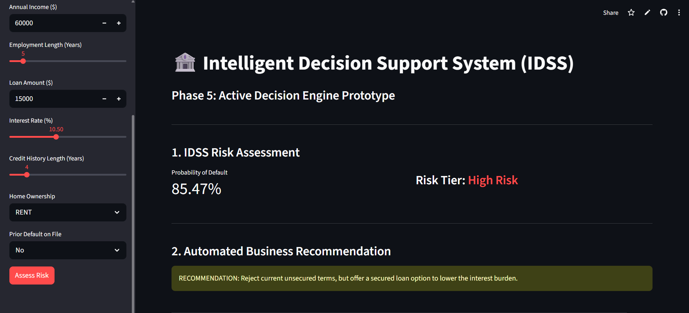
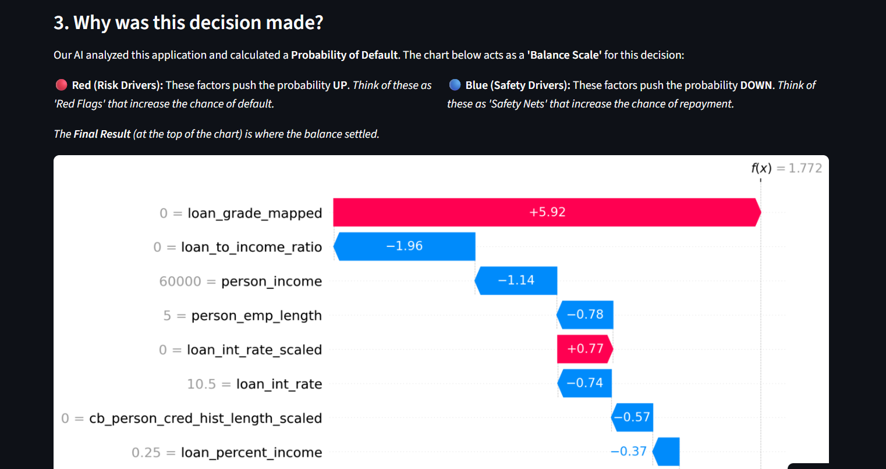
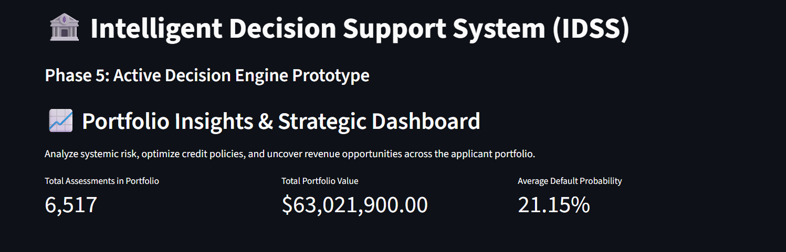
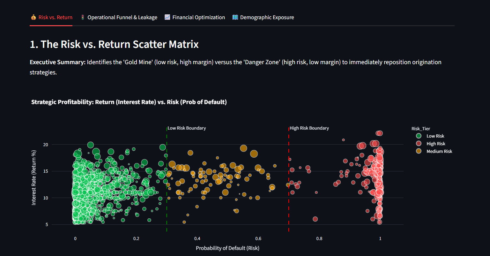
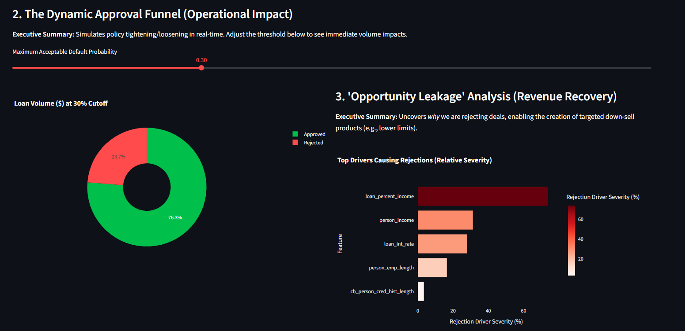
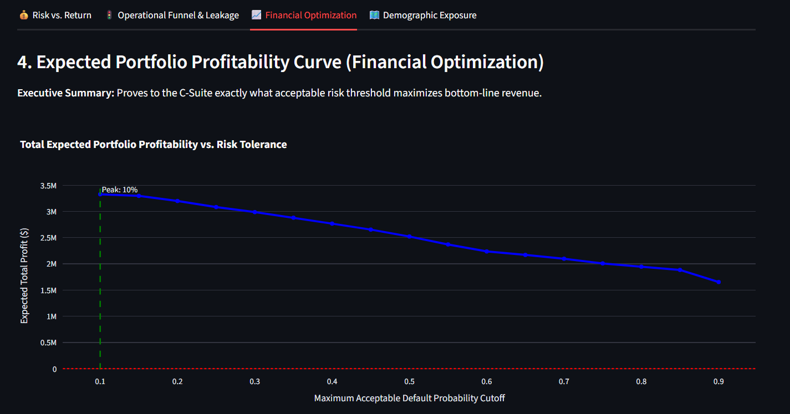
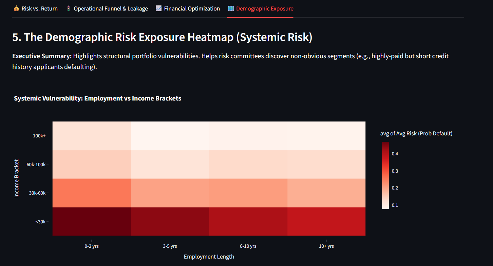

# 🏦 Intelligent Decision Support System (IDSS) for Credit Risk

This project is a full credit-risk decision intelligence stack built to help lenders, underwriters, and risk managers move from raw model scores to explainable business decisions.

It combines:
- predictive modeling with XGBoost,
- explainability with SHAP,
- Gemini-powered business narration,
- and a Streamlit dashboard that supports both applicant-level decisions and portfolio-level strategy.

---

## 1. Problem Statement

Banks need to approve profitable loans quickly, but they also need to avoid costly defaults and comply with lending regulations. In practice, that means the institution needs two things at the same time:

- strong prediction accuracy,
- and a clear explanation of why a decision was made.

Most high-performing ML models are not naturally explainable. That creates a business problem:

- a loan officer may not be able to justify a rejection,
- a risk team may not know which portfolio segments are driving losses,
- and executives may not know which policy thresholds actually maximize revenue.

This IDSS project solves that gap by turning model predictions into actionable business intelligence.

## 2. Business Value

The system was designed to create value across three levels of the banking workflow.

### For Underwriters
- explains the reason behind an approval or rejection,
- suggests next best actions,
- and supports faster manual review for borderline applicants.

### For Risk Managers
- simulates approval thresholds in real time,
- shows where good applications are being lost,
- and helps identify structural portfolio risk patterns.

### For Executives
- shows how risk and return interact,
- identifies the threshold that maximizes expected profit,
- and makes the portfolio easier to govern with data-backed policy decisions.

The result is a system that improves decision speed, reduces blind spots, and makes the lending process more explainable and more strategic.

## 3. What This Project Adds to the Banking System

This is not just a prediction model. It is an end-to-end decision support layer for credit risk.

It adds five major capabilities:

1. **Transparent decisions** through SHAP-based explainability.
2. **Business-readable recommendations** through Gemini-generated narrative output.
3. **Interactive applicant assessment** through Streamlit inputs and JSON uploads.
4. **Portfolio strategy analysis** through risk/return, funnel, profit, and heatmap visuals.
5. **A reusable IDSS workflow** that can be adapted for churn, default, fraud, or other binary risk problems.

---

## 4. End-to-End Project Workflow

The project was built in a phased workflow so each stage could be validated before moving to the next.

### Phase 1: Exploratory Data Analysis
Purpose: understand the raw structure of the dataset before modeling.

What was done:
- inspected the target distribution,
- checked for missing values,
- reviewed class imbalance,
- explored numerical distributions,
- and examined relationships between major credit features.

This stage helped identify the dominant signals in the data and determine which features would likely matter most to the model.

### Phase 2: Preprocessing and Feature Engineering
Purpose: convert raw input into a training-ready format.

What was done:
- handled missing values,
- normalized or scaled numeric fields where needed,
- created engineered ratios such as `loan_to_income_ratio`,
- encoded categorical variables with one-hot encoding,
- and aligned the final feature matrix with the model input schema.

This phase was essential because the model expects stable numeric inputs, not raw text categories.

### Phase 3: Predictive Modeling
Purpose: train a high-performing model for default prediction.

What was done:
- selected XGBoost as the main learner,
- tuned the model to better detect minority default cases,
- evaluated model behavior on the holdout set,
- and serialized the trained model as `best_credit_risk_model.joblib`.

We also resolved a deployment issue caused by the newer XGBoost base score format by pinning the environment to `xgboost==1.7.6`.

### Phase 4: Explainability and Segmentation
Purpose: translate model outputs into business logic.

What was done:
- used global SHAP to identify the strongest overall drivers,
- used local SHAP to explain single-applicant decisions,
- segmented customers into low, medium, and high risk groups,
- and converted technical model output into plain-English reasoning.

### Phase 5: Streamlit IDSS Prototype
Purpose: deliver the model through a usable business interface.

What was done:
- built an underwriter-facing decision screen,
- enabled manual input and JSON upload,
- added Gemini-backed recommendation and explanation modules,
- and created portfolio dashboards for executive monitoring.

---

## 5. Model and Decision Logic

The app calculates a default probability using the trained XGBoost model and then uses that score to drive the user experience.

### Applicant-Level Logic
- the applicant data is converted into model-ready features,
- a default probability is generated,
- the applicant is assigned a risk tier,
- SHAP values identify the strongest positive and negative contributors,
- Gemini converts those contributors into a grounded recommendation and explanation.

### Portfolio-Level Logic
- the entire test portfolio is scored,
- approvals and rejections are simulated at different thresholds,
- expected profitability is estimated,
- and portfolio vulnerabilities are shown through interactive visual analysis.

The static loan-grade warning was intentionally removed from the recommendation logic because it is not a user-entered input. That keeps recommendations focused on the applicant data that actually exists in the UI.

---

## 6. Streamlit Application Overview

The app is organized into two main views.

### A. Active Decision Engine
This view is designed for underwriters and analysts working on one applicant at a time.

It supports:
- manual form entry,
- JSON applicant uploads,
- probability of default scoring,
- Gemini-based recommendation generation,
- Gemini-based explanation generation,
- and an interactive SHAP waterfall visualization.

### B. Portfolio Insights Dashboard
This view is designed for managers and executives who need a portfolio-wide picture.

It includes:
- a risk vs. return scatter plot,
- a dynamic approval funnel,
- a rejection leakage analysis,
- an expected profitability curve,
- and a demographic risk exposure heatmap.

---

## 7. Visuals and Outputs

The following screenshots live in the `images/` folder.

### Active Decision Engine



This screen shows the applicant-level workflow, including the default probability, risk tier, Gemini recommendation, and the explanation section.

### Interactive SHAP Waterfall



This chart shows the strongest positive and negative model contributions in an interactive dashboard format.

### Portfolio Insights Overview



This screen summarizes portfolio size, exposure, and average default risk.

### Risk vs. Return Scatter Plot



This chart helps identify the profitable low-risk zone and the dangerous high-risk zone.

### Dynamic Approval Funnel



This chart shows how changing the approval threshold changes the distribution of approved and rejected loan volume.

### Expected Portfolio Profitability Curve



This chart identifies the threshold where expected profit is highest.

### Demographic Risk Exposure Heatmap



This chart shows which income and employment segments produce the highest average default risk.

---

## 8. Explanation Layer Powered by Gemini

The Streamlit app now includes an AI explanation and recommendation layer that uses the `google.genai` SDK and Gemini 2.5 Flash.

It performs two tasks:

### AI Recommendation
Generates a short business recommendation based on:
- the applicant profile,
- the model probability,
- the risk tier,
- and the top SHAP drivers.

### AI Explanation
Generates a deeper narrative that answers:
- why the score is what it is,
- what the key risk drivers mean,
- what the business impact is,
- and what actions should be taken.

Both prompts are constrained to use only the supplied data, which helps reduce hallucination and keeps the output aligned to the model result.

---

## 9. Technical Stack

- **Machine Learning:** XGBoost, scikit-learn
- **Explainable AI:** SHAP
- **AI Text Generation:** Google Gemini via `google.genai`
- **Dashboard:** Streamlit
- **Visual Analytics:** Plotly, Matplotlib
- **Data Handling:** Pandas, NumPy
- **Model Artifacts:** Joblib

---

## 10. Repository Structure

```text
IDSS Project - Copy/
├── app.py
├── README.md
├── requirements.txt
├── best_credit_risk_model.joblib
├── model_features.joblib
├── Dataset/
│   └── X_test_phase3.csv
├── images/
│   ├── active_decision_engine.png
│   ├── ai_explanation.png
│   ├── demographic_heatmap.png
│   ├── dynamic_funnel.png
│   ├── global_shap_summary.png
│   ├── leakage_analysis.png
│   ├── portfolio_overview.png
│   ├── profit_optimization.png
│   ├── recommendation_output.png
│   ├── risk_vs_return.png
│   └── shap_waterfall.png
```

---

## 11. How to Run the Project

### 1. Activate your environment

```powershell
Set-ExecutionPolicy -Scope Process -ExecutionPolicy RemoteSigned
& ".venv\Scripts\Activate.ps1"
```

### 2. Install dependencies

```bash
pip install -r requirements.txt
```

### 3. Add your Gemini API key

Create a `.streamlit/secrets.toml` file or set an environment variable:

```toml
GOOGLE_API_KEY = "your-api-key-here"
```

### 4. Start the app

```bash
streamlit run app.py
```

### 5. Open the dashboard

Use the sidebar to switch between:
- Active Decision Engine
- Portfolio Insights

---

## 12. Notes and Design Decisions

- The UI was built to feel like a banking product, not a generic data science demo.
- The static loan-grade rule was removed from the recommendation flow because it is not a user-input feature.
- The SHAP visual was upgraded from a static image to an interactive dashboard component.
- The recommendation and explanation layers are now API-backed so the app can express the model outcome in business language.
- The portfolio dashboard is deliberately designed for decision-makers who need to evaluate exposure, profitability, and policy impact quickly.

---

## 13. Expected Outcome

This IDSS helps the banking system do three things better:

- approve better loans,
- reject risk more consistently,
- and explain decisions in a way both business users and regulators can understand.

That makes it useful not only as a model demo, but as a practical decision support layer for real lending operations.
